## Customizações web
* Iniciando o ui com o boostrap, e criando o skeleto de rotas views e controles de autenticação:
```php artisan ui bootstrap --auth```
* Executar o npm install para compilar o scaffold e adicionar o boostrap e as outras dependencias:
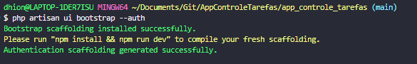
``` npm install ```
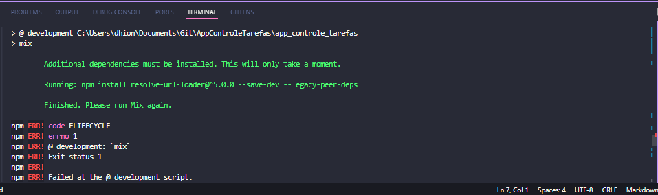 erro ao adicionar um dependencia rodar novamentemo :
```npm install resolve-url-loader@^5.0.0 --save-dev --legacy-peer-deps```
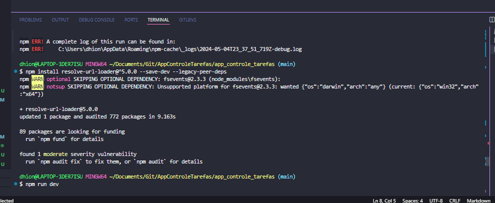
em seguida o 
```npm run dev ```
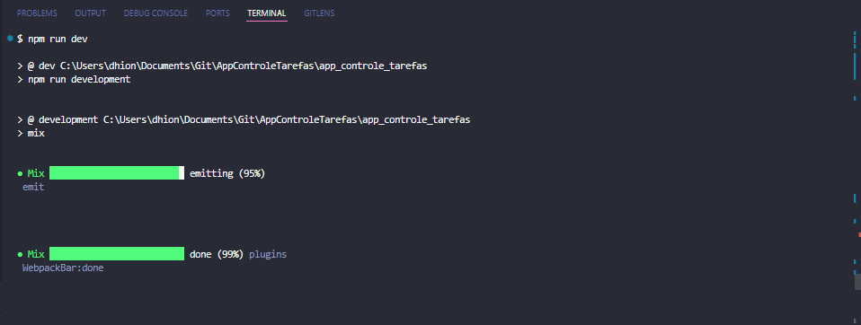

* Fazer as configurações de banco de dados no arquivo .env
* Executar as migration:
```php artisan migrate```  
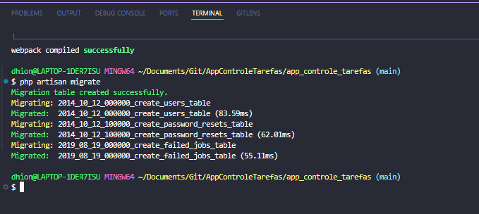

* Criando o Model e o Controller de tarefa
```php artisan make:controller --resource TarefaController --model=Tarefa```
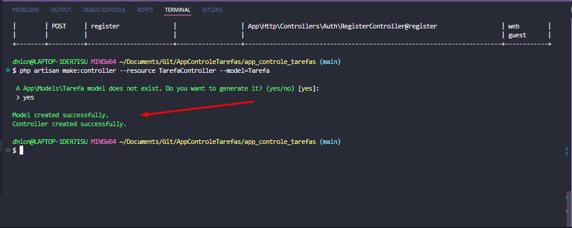

* Fazendo as configurações do smtp pelo arquivo .env
* habilitando o reset de senha
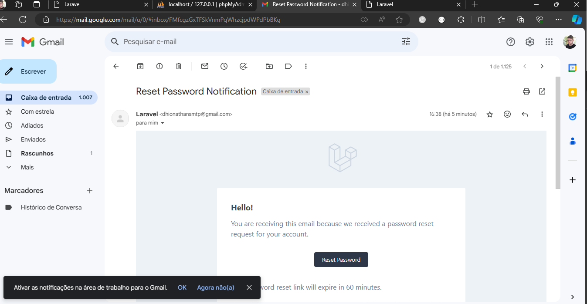

* Criando template de email com markdown Mailables
```php artisan make:mail MensagemTesteMail --markdown emails.mensagem-teste```
* Enviando o email com template personalizado:
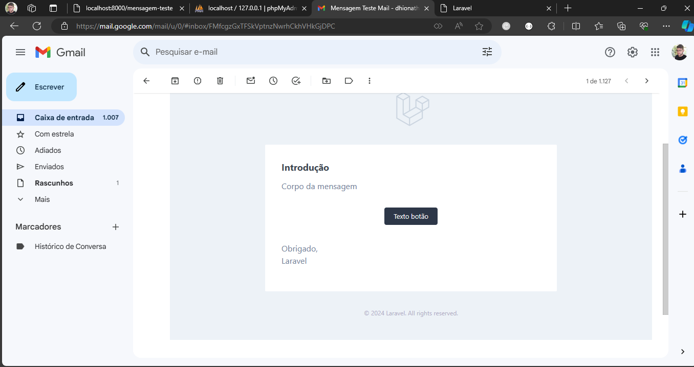

* Publicando o template de email para poder ser customizado e editado sem mexer nos códigos raiz.
* Execute o comando
 ```php artisan vendor:publish```
 E selecione o 14 para publicar o mail
 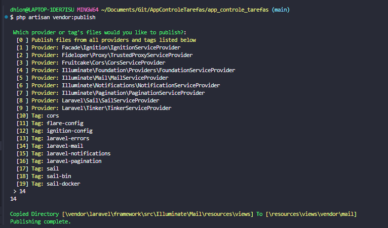
 * Criando uma classe de notificação para Redefinir a senha, para que não seja necessários mexer nos métodos padrões do framework
 ```php artisan make:notification RedefinirSenhaNotification```
 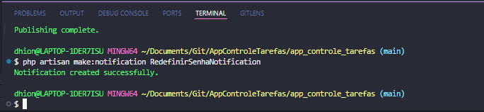

 * Conclusão:
 * 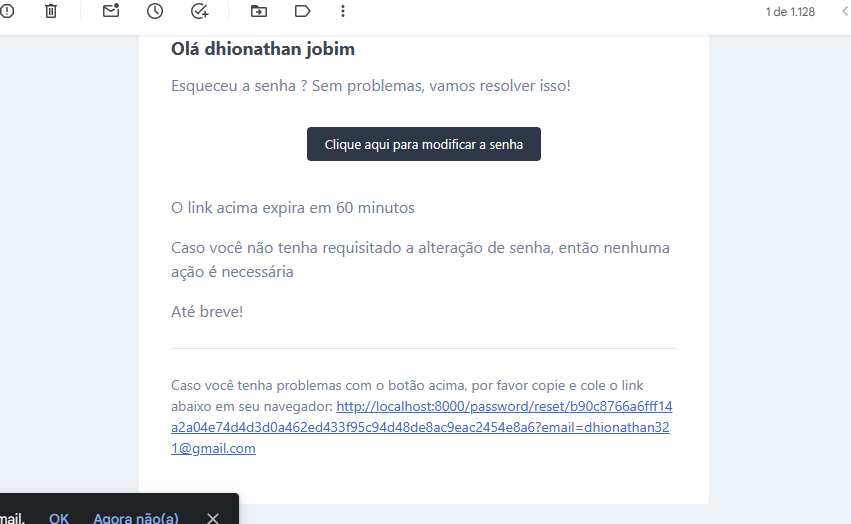

* Habilitando Verificação de email:
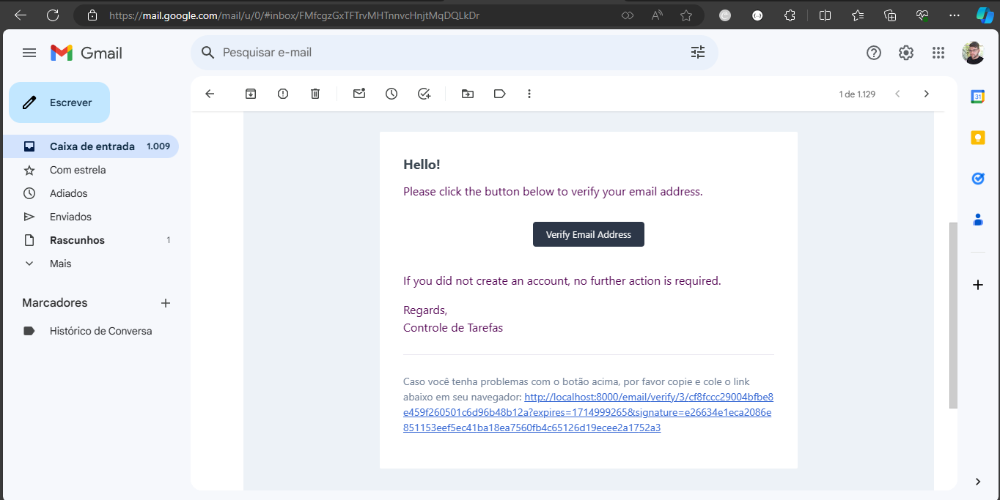

* Customizando email de verificação de email
```php artisan make:notification VerificarEmailNotification ```
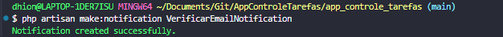

* Criando tabela tarefas:
```php artisan make:migration create_tarefas_table```
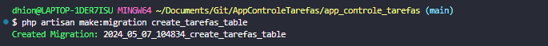
```php artisan migrate```
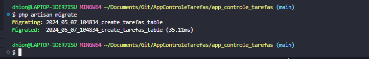

Criando novo email para tarefas
```php artisan make:mail NovaTarefaMail --markdown emails.nova-tarefa```

* Criando migration pare relacionar tarefas a um usuário:
```php artisan make:migration alter_table_tarefas_relacionamento_users```

* Executando a migrate:
```php artisan migrate ```
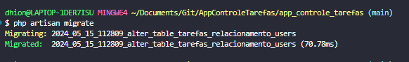

* Instalando o pacote laravel Excel:
No diretório do projeto chamar:
*OBS: Foi necessário abrir o terminal bash como administrador e atualizar o composer para a versão 2 ```composer self-update --2 ```
```composer require maatwebsite/excel:^3.1.0 --ignore-platform-reqs```
* É necessário publicar o arquivo exel para poder fazer configurações específicar para n ter que mexer na classe vendor:
```php artisan vendor:publish --provider="Maatwebsite\Excel\ExcelServiceProvider" --tag=config ```
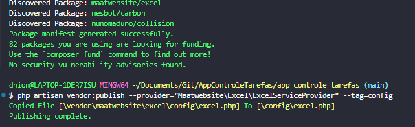

* Criando uma classe de exportação para Tarefa
``` php artisan make:export TarefasExport --model=Tarefa```
* OBS: Para o perfeito funcionamento foi necessário ativar essa extensção no php.ini ```;extension=gd ``` e atualizar o composer:
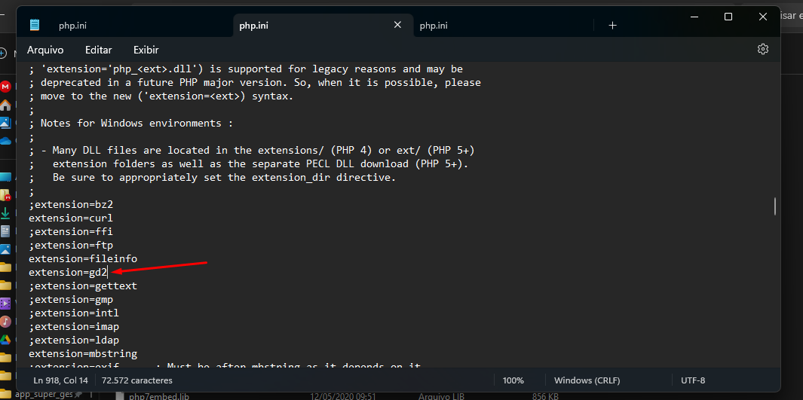
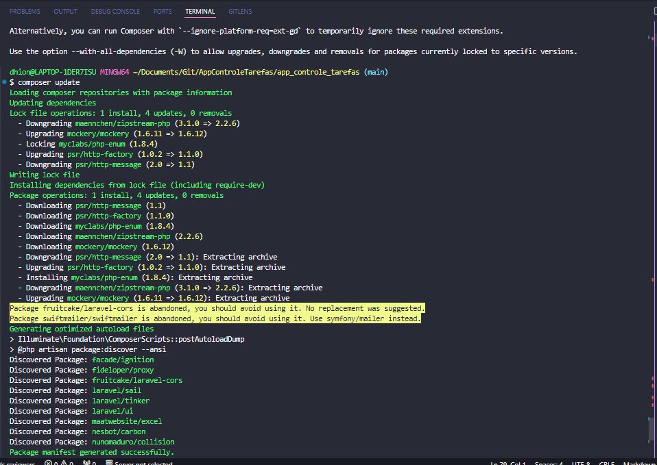