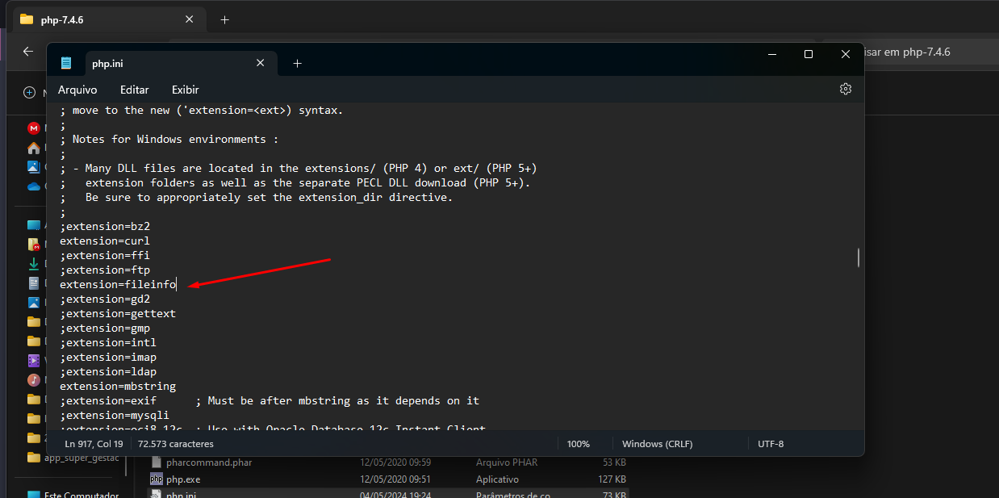
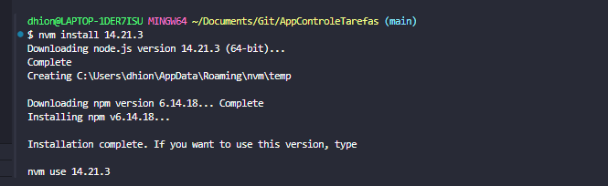
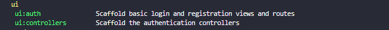

# AppControleTarefas
Aplicação de controle de tarefas, Curso Desenvolvimento Web Avançado Laravel Vue.js
## Criando ambiente:
* Remova o ; do fileinfo do php.ini



* Criando projeto laravel:
```composer create-project --prefer-dist laravel/laravel app_controle_tarefas "8.5.9"```
*  Instalando nodejs versão 14.21.3
```nvm install 14.21.3 ```

* Com os privilégios de administrador executar:
```nvm use 14.21.3```

* Instalando laravelUi
```composer require laravel/ui:^3.2```
* Ao executar php artisan list, será exibido essas duas novas funcionalidades
